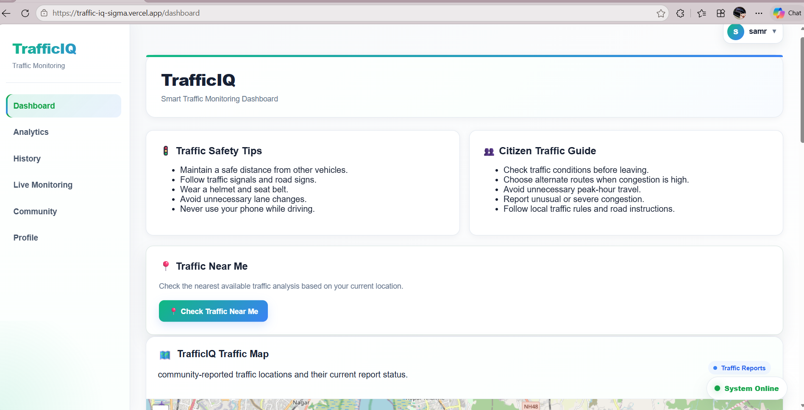
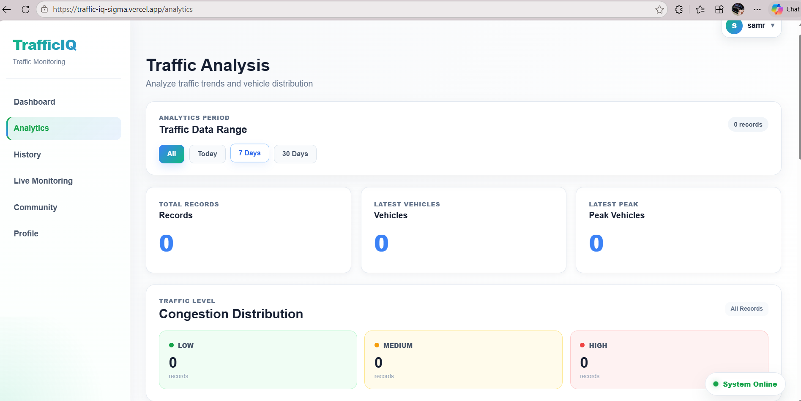
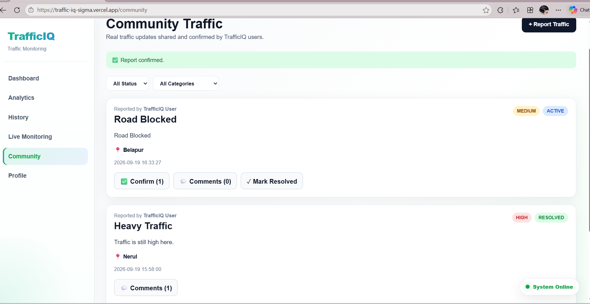
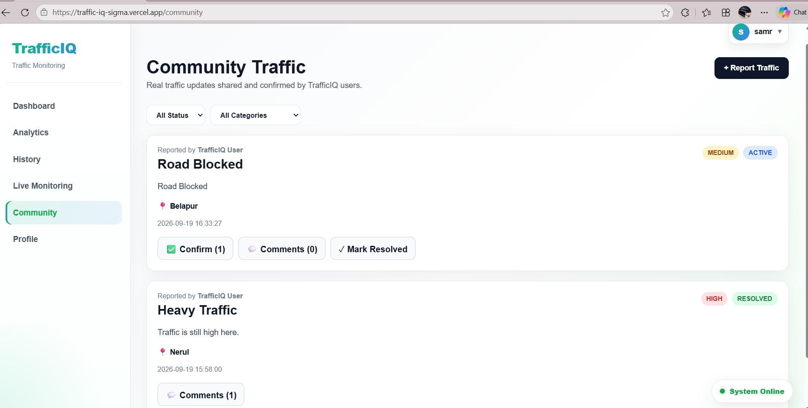
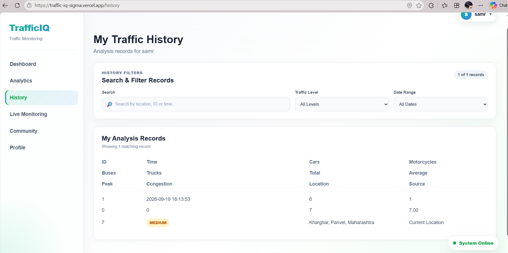
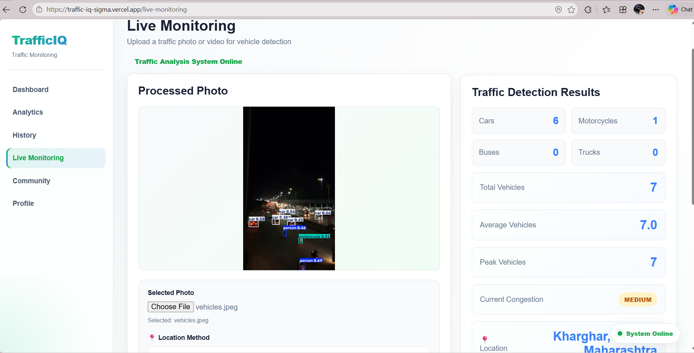
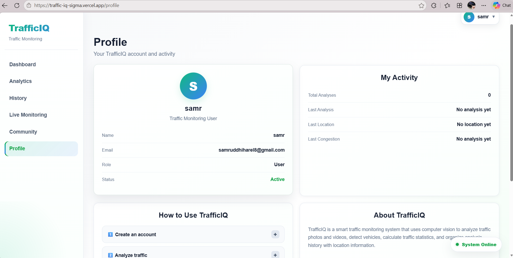
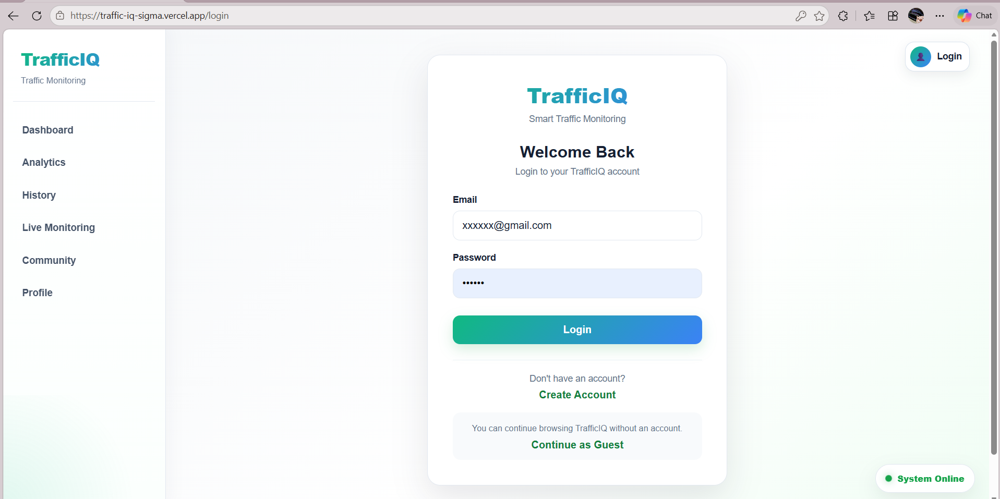

# 🚦 TrafficIQ

### Intelligent Traffic Analytics & Community Monitoring Platform

TrafficIQ is an AI-powered traffic monitoring and community reporting platform that combines **Computer Vision, Machine Learning, Full-Stack Web Development, and Cloud Deployment** to provide real-time traffic insights and user-generated traffic reports.

🔗 **Live Demo:** https://traffic-iq-sigma.vercel.app/

---

## 📌 Project Overview

TrafficIQ is designed to make traffic monitoring more intelligent, accessible, and community-driven.

The platform allows users to:

* Monitor traffic conditions
* Detect and analyze vehicles using AI
* View traffic-related information
* Report road and traffic problems
* Confirm reports submitted by other users
* Add comments to community reports
* Mark resolved issues
* Track traffic conditions through an interactive web interface

The system uses **YOLO-based computer vision** for vehicle detection and a **FastAPI backend** for processing traffic data and managing community features.

---

## ✨ Features

### 🤖 AI Traffic Detection

* Vehicle detection using YOLO
* Computer vision based traffic analysis
* Vehicle counting
* Traffic density analysis
* Processed traffic visualization

### 🚦 Traffic Monitoring

* Traffic condition monitoring
* Traffic classification
* Location-based traffic information
* Traffic analytics dashboard

### 👥 Community Traffic Reporting

Users can report:

* 🚗 Heavy Traffic
* 🚧 Road Blocked
* 💥 Accident / Crash
* 🚦 Signal Issue
* 🔀 Traffic Diversion
* 🛣️ Lane Closure
* 🚙 Vehicle Breakdown
* 🗺️ Route Suggestion

### ✅ Community Verification

Users can:

* Confirm traffic reports
* View confirmation counts
* Comment on reports
* Mark reports as resolved
* Filter reports by category and status

### 🔐 Authentication

* User registration
* User login
* JWT-based authentication
* Protected community actions

### ☁️ Cloud Deployment

* Frontend deployed on Vercel
* Backend deployed on Railway
* Persistent SQLite storage using Railway Volume

---

# 🛠️ Tech Stack

## Frontend

* React
* Vite
* JavaScript
* CSS
* HTML

## Backend

* Python
* FastAPI
* SQLite
* JWT Authentication
* Pydantic
* Uvicorn

## AI / Computer Vision

* YOLO
* Ultralytics
* OpenCV
* Python

## Deployment

* Vercel
* Railway
* GitHub
* Railway Persistent Volume

---

# 🏗️ System Architecture

```text
                    ┌───────────────────┐
                    │       USER        │
                    └─────────┬─────────┘
                              │
                              ▼
                 ┌──────────────────────┐
                 │   React + Vite       │
                 │     Frontend         │
                 └──────────┬───────────┘
                            │
                            │ REST API
                            ▼
                 ┌──────────────────────┐
                 │      FastAPI         │
                 │       Backend        │
                 └───────┬───────┬──────┘
                         │       │
             ┌───────────┘       └────────────┐
             ▼                                ▼
     ┌─────────────────┐              ┌─────────────────┐
     │ YOLO + OpenCV   │              │  Community      │
     │ Vehicle         │              │  Reporting      │
     │ Detection       │              │  & Verification │
     └────────┬────────┘              └────────┬────────┘
              │                                │
              └──────────────┬─────────────────┘
                             ▼
                    ┌─────────────────┐
                    │     SQLite      │
                    │    Database     │
                    └─────────────────┘
```

---

# 🧠 AI / Computer Vision Pipeline

```text
Input Image / Video
        │
        ▼
   YOLO Detection
        │
        ▼
Vehicle Detection
        │
        ▼
Vehicle Counting
        │
        ▼
Traffic Density Analysis
        │
        ▼
Traffic Information
```

---

# 📂 Project Structure

TrafficIQ follows a modular full-stack architecture with separate frontend, backend, AI/ML, documentation, and processing directories.

```text
traffic-iq/
│
├── frontend/                         # React + Vite frontend
│   ├── public/                       # Static public assets
│   ├── src/                          # Frontend source code
│   │   ├── assets/                   # Frontend assets
│   │   ├── components/               # Reusable UI components
│   │   ├── pages/                    # Application pages
│   │   ├── App.jsx                   # Main application component
│   │   └── main.jsx                  # Frontend entry point
│   ├── .gitignore                    # Frontend ignored files
│   ├── eslint.config.js              # ESLint configuration
│   ├── index.html                    # Frontend HTML entry
│   ├── package.json                  # Frontend dependencies & scripts
│   ├── package-lock.json             # Dependency lock file
│   ├── vercel.json                   # Vercel deployment configuration
│   ├── vite.config.js                # Vite configuration
│   └── README.md                     # Frontend documentation
│
├── backend/                          # FastAPI backend
│   ├── database.py                   # Database configuration & initialization
│   ├── insert_data.py                # Database seed/sample data
│   ├── main.py                       # API routes & backend server
│   ├── requirements.txt              # Python dependencies
│   └── traffic_processor.py          # Traffic processing & AI integration
│
├── ml/                               # Machine Learning components
│   ├── src/                          # ML source code
│   └── videos/                       # ML input/test videos
│
docs/                             # Project documentation
│
├── screenshots/                  # Screenshot placeholder directory
│   └── .gitkeep
│
├── ai-detection.png
├── community.png
├── dashboard.png
├── history.png
├── live-monitoring.png
├── login.png
├── profile.png
└── report-form.png
│
├── uploads/                          # Uploaded images and videos
├── processed/                        # AI-processed output files
├── runs/                             # YOLO detection results
│   └── detect/                       # Detection outputs
│
├── .gitignore                        # Ignored files & directories
├── LICENSE                           # MIT License
├── README.md                         # Main project documentation
└── yolo11n.pt                        # YOLO model weights
```

> Note: Local SQLite database files such as `traffic.db` are excluded from the repository using `.gitignore`.
---

# 📸 Screenshots

### 🏠 Dashboard


### 🤖 AI Traffic Detection


### 👥 Community Traffic Reports


### 📝 Report Traffic


### 📊 Traffic History


### 🚦 Live Monitoring


### 👤 User Profile


### 🔐 Login


---

# 🌐 Live Deployment

### Frontend

🔗 https://traffic-iq-sigma.vercel.app/

### Backend API

🔗 https://traffic-iq-production.up.railway.app/

### API Status

The backend provides REST APIs for authentication, traffic monitoring, and community reporting.

---

# 📡 API Overview

## Authentication

```text
POST /auth/register
POST /auth/login
```

## Traffic

```text
GET /traffic-data
POST /traffic-data
```

## Community Reports

```text
GET  /community/reports
POST /community/reports

GET  /community/reports/{id}/comments
POST /community/reports/{id}/comments

POST /community/reports/{id}/confirm
POST /community/reports/{id}/resolve
```

### Community Reporting

The community module supports creating, confirming, commenting on, filtering, and resolving traffic reports.

### Health Check

```text
GET /
```


---

# 🚀 Getting Started

## 1. Clone the Repository

```bash
git clone https://github.com/samruddhiii012/traffic-iq.git

cd traffic-iq
```

---

## 2. Frontend Setup

```bash
cd frontend
npm install
npm run dev
```

Frontend will run on:

```text
http://localhost:5173
```

---

## 3. Backend Setup

Open another terminal:

```bash
cd backend

pip install -r requirements.txt

uvicorn main:app --reload
```

Backend will run on:

```text
http://localhost:8000
```

---

# ⚙️ Environment Variables

For local development:

```env
DATABASE_PATH=traffic.db
```

For Railway production:

```env
DATABASE_PATH=/app/data/traffic.db
```

Do not commit `.env` files, API keys, passwords, or production secrets.


# 🗄️ Database

TrafficIQ uses SQLite for application data.

Main database entities include:

```text
users
traffic_data
traffic_reports
report_confirmations
report_comments
```

Community reports are persisted using a Railway Volume in the production deployment.

---

# 🔒 Security

The project uses:

* JWT authentication
* Protected API endpoints
* Environment variables for configuration
* `.gitignore` for sensitive/local files

Never commit:

```text
.env
API keys
Passwords
Private credentials
Production secrets
```

---

# ☁️ Deployment

### Frontend

Deployed using:

**Vercel**

### Backend

Deployed using:

**Railway**

### Database Persistence

Production SQLite database is stored using a:

**Railway Persistent Volume**

---

# 🎯 Future Improvements

Potential future improvements include:

* Real-time traffic camera integration
* Live traffic maps
* Advanced traffic prediction
* More detailed analytics
* Emergency service integration
* Traffic congestion forecasting
* Mobile application
* WebSocket-based live updates
* Advanced AI traffic classification

---

# 👨‍💻 Author

### Samruddhi S. Harel

Engineering Student & Developer

GitHub:
https://github.com/samruddhiii012

---

# ⭐ Support

If you find this project interesting, consider giving the repository a ⭐ on GitHub.

---

## 📄 License

This project is licensed under the MIT License.
